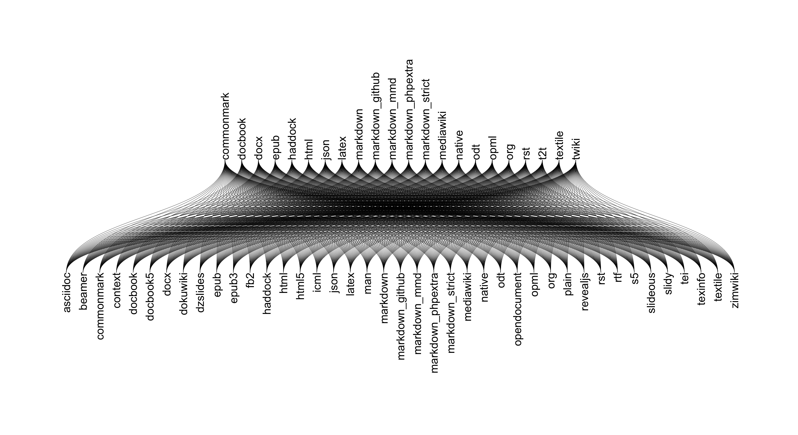

# What are dynamic documents?

<!--
Thanks for coming everyone. I'm happy to kick off our session on using dynamic
documents for reproducible research. My name is Pierce Edmiston, and I'm
presenting with two other members of the Madpy and MadR communities. Tristan
Mahr will be talking about Rmarkdown documents, and Scott Sievert will be
talking about Jupyter notebooks. But before we get to the cool stuff, I wanted
to start by introducing dynamic documents for people who may not be familiar
with them and why I think they're worth using.
-->

Reproducible ways of communicating data science results.


<!--
Here is a typical data science workflow: you start by importing some data,
you spend most of your time tidying it up, then you try to understand
that data through visualizations and models, and once you've figured out
what's in the data, you're ready to communicate that understanding to someone
else.

Dynamic documents are really what connects the gap between doing some analysis
and communicating the results. You can't see it in this figure, but most of the
time there is this gap between results and communication. Your results are just
the outputs of your analysis scripts, so numbers printed from python or R or
whatever you are using to do your stats. To communicate these results, you need
to physically move the results into the document.

Most of the time we do this moving with copy & paste. We can write an email to collaborators, pasting in the numbers and plots, and send it off.

But then you get the dreaded email:
-->

# The parable of the old dataset

```
Karl -- this is very interesting,
however you used an old version of
the data (n=143 rather than n=226).

I'm really sorry you did all that
work on the incomplete dataset.

Bruce
```

_"The dreaded email." By [Karl Broman](https://www.biostat.wisc.edu/~kbroman/presentations/repro_research_JSM2016.pdf)._

<!--
Getting an email like this fills me with dread because it immediately says I'm
going to have to waste time doing things that I've already done.

Unless... you're using dynamic documents.

If you instead sent your collaborators a dynamic document, it would take no time
at all to run the analysis on the new data. Dynamic documents are the last step
in the chain of making every aspect of a data science workflow automated and
reproducible.

But there's another way dynamic documents might be the answer to this parable. 
If you send your collaborators dynamic documents that they can easily reproduce 
on their own computers, then they can run the document with the new data, so you
don't even have to.

(I realize this may seem a bit Utopian but given some of the interactivity 
that's available through Rmarkdown documents and jupyter notebooks, it's not 
that far off.)
-->

# Other reasons for writing dynamic documents

> - For scientific integrity.
> - They are futuristic and cool.
> - So I can write in whatever editor I want.
> - Because I'm obsessed with automation.

<!--
There are other reasons for using dynamic documents other than them saving
you time.

One of the reasons TJ, Scott, and I all use dynamic documents is because we 
believe they are in line with the true spirit of science: they encourage being
open and transparent with every decision you make with your data.

A slightly less lofty reason is that dynamic documents are futuristic and cool.
They allow you to publish things to the web and take advantage of browser
features without being a web developer.

Another reason I like dynamic documents is that they are written in plaintext,
so I can use whatever editor I like. That way I can write dynamic documents
just like I write code, and go back and forth very easily.

Finally, the last reason I like dynamic documents is that I'm obsessed with
automation, and the idea that I can reproduce entire research workflows
by compiling a single document is just really neat.
-->

# Markdown documents can be simple dynamic documents

Contents of `game-of-thrones-fan-fic.md`:

```
    # Chapter 1

    **John Snow is bold**.

    # Chapter 2

    _Arya Stark is italic_.
```

```bash
$ npm install -g md-fileserver
$ mdopen game-of-thrones-fan-fic.md
```

<!--
To introduce dynamic documents, I'm going to start with something very simple,
and that is a Markdown document. Markdown documents can be simple dynamic
documents.
-->

# Dynamic documents are written in markup languages

Example markup languages:

- Markdown (Gruber flavored?)
- Github flavored Markdown
- CommonMark
- **Rmarkdown**
- **Jupyter notebooks**: python + markdown = JSON??

<!--
Markdown is a markup language. In general, dynamic documents are written in
markup languages, but there are some annoying exceptions.

So for instance, the original Markdown came from John Gruber, but it was pretty
minimal and really only for converting to HTML, so there have been various other
flavors of Markdown that have been invented. GitHub has it's own flavor of
Markdown and there are efforts to replace the original Markdown spec with
CommonMark. And there are extensions as well, so there's a version called
Rmarkdown which TJ will show you that allows you to write Markdown documents
with embedded code chunks.

There is an effort to create a "pymarkdown" which would be like Rmarkdown but for python, but I've played around with it, and it's not nearly as good as
Rmarkdown.

If you want python and Markdown, you likely want to use a Jupyter notebook. This
is what Scott will be showing off. With a Jupyter notebook you are basically
writing either markdown or python, but under the hood, the actual notebook file
stores all of that in JSON, which I've always found kind of annoying.
-->

# pandoc

> Wouldn't it be great to have a universal document converter?  
-- John MacFarlane, Professor of Philosophy, UC-Berkeley

```bash
pandoc --from markdown --to docx game-of-thrones-fan-fic.md
```

<!--
If you've worked with different markup language extensively, you may have run
into pandoc. pandoc is billed as a "universal document converter". It was the
idea of a philosopher at Berkeley named John MacFarlane.
-->

# pandoc formats



# A more typical pandoc workflow


# A simple dynamic document with pandoc

```Makefile
# Create slides.pdf from intro.md and img/pandoc-formats.png
slides.pdf: intro.md img/pandoc-formats.png
  pandoc -t beamer -V theme=metropolis -o $@ $<

# Create pandoc-formats.png by running pandoc-formats.R
img/pandoc-formats.png: pandoc-formats.R
  ./pandoc-formats.R
```

# Now on to the fun stuff!

Pierce Edmiston  
github.com/pedmiston/forward-summit
