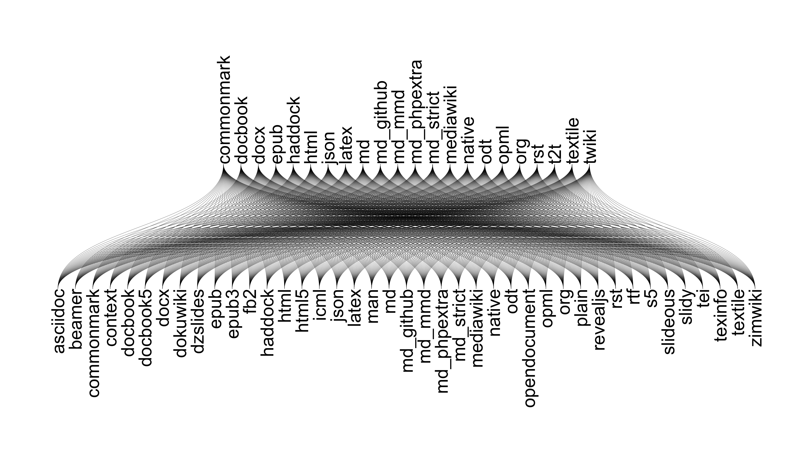

# Overview

Dynamic documents for reproducible research

**Pierce**: Introducing dynamic documents  
**Tristan**: RMarkdown documents  
**Scott**: Jupyter notebooks  

# Three parables for dynamic documents

1. The final dataset
2. The only hypothesis
3. The predicted results

# The parable of the final dataset

The dreaded email:  
> That wasn't the final data. Use this data instead.

* * *
The parable of the last dataset is something that happens any time you
think a dataset is final, but you end up getting more or different data in
place of it later on, and have to redo the same analyses again.

Here's the story: you get a dataset, thinking that all you have to do is
analyze this particular dataset, so you start exploring and making some plots,
fitting some models, and you write this nice long email to your collaborators
where you summarize your findings and attach plots and stats to support your
key points.

Then you get the dreaded email.

"That wasn't the right data. Use this data instead." Sometimes it isn't an
issue, and you can redo your analysis on the new data no problem. Undoubtedly
you **can** do the same analysis on new data. The question is how pissed off
you're going to be for having to do the same thing twice: remaking the plots,
and copying and pasting all those numbers you included the first time.

So now imagine an alternative reality where you had instead sent a dynamic
document to your collaborators. Since you wrote your analysis in a dynamic
document, the only change you need to make is to reference the new data, and
recompile, and all of the plots and stats are updated automatically.

But here's the really radical point. I admit this is a little utopian, but
I still believe it's possible. Because you sent your collaborators dynamic
document, instead of asking you to plug in the new data, they can actually do
it themselves. **Writing dynamic documents makes it easier for collaborators to
interact with your code.**


# The parable of the only hypothesis

A question from the audience:  
> What happens if you include X / exclude Y?  

* * *
The parable of the only hypothesis is what happens when you analyze some
data with a single hypothesis in mind, but then you tell people about the data,
and they inevitably ask you about something you didn't test.

When I'm analyzing some data, I never presume to know everything about the data
going in. Most of the time I learn something about the data, and what I learned
has consequences for decisions I made earlier in the analysis.

An easy example is discovering outliers in your data. Maybe you find that some
of your data is invalid for some reason, and now you need to redo all those
plots with the data removed.

Writing dynamic documents is an effective way of turning an analysis into
a pipeline from raw data to published findings, with all the decisions you made
along the way documented in code, so that you can very easily change things at
any stage based on what you have learned about the data.

The empowering aspect of dynamic documents is that I don't fear sending out
preliminary results and exploratory data analysis. I can make a quick and dirty
plot, draw some conclusion from it, acknowledging that things might change
later, but if they hold I have that same plot that I can clean up later.


# The parable of the predicted results

> The results were as predicted.
_How do we know?_

* * *
The parable of the future experiment is a more positive use case for
dynamic documents. The other two parables are about how dynamic documents can
save you time when the data and your hypotheses about the data are changing.
This parable is about something you can do with dynamic documents that you
can't do without them.

The basic idea is that often people especially in the published literature will
start their results sections with things like "The results were as predicted"
and every time I read that a little light goes on in my head, and I say, "Sure
they were."

So how do you know that someone actually made the predictions they claimed to
make? If they wrote their predictions down in a dynamic document, it is much
easier to verify their claim, and it's stronger evidence that their conclusions
were valid and will apply in new contexts.

My point here is not that we can't believe people unless they are using
dynamic documents, but that using dynamic documents encourages more honest
reporting.

The idea that dynamic documents encourage this sort of honesty when it comes
to scientific reporting is one of the reasons TJ, Scott, and I all care
about dynamic documents. We are all PhD students at UW-Madison, and
we believe that dynamic documents are the future standard for scientific
reporting.


# Defining qualities of dynamic documents

1. Reproducible
2. Agnostic* about style

* * *
The two qualities that I think are most descriptive of dynamic documents
are that they are reproducible, and that they are agnostic about style.

Reproducibility is a pretty big concept, and it's not all or none, but
a good litmus test for reproducibility is to ask yourself how long would
it take me to do this on someone else's computer?

The second quality is that dynamic documents are at least in theory
agnostic about style. You can write the same dynamic document to
multiple outputs, whether you want to share the work as an html document,
as a LaTeX pdf, or even as a Word doc.

In practice, you will have to tweak things to get them to show up just
how you like them in each format, but the bulk of the document should
not be written in a way that's specific to just one format.


# Markdown documents can be dynamic

Contents of `game-of-thrones-fan-fic.md`:

```
    # Chapter 1

    **John Snow is bold**.

    # Chapter 2

    _Arya Stark is italic_.
```

```bash
$ npm install -g md-fileserver
$ mdopen game-of-thrones-fan-fic.md
```

* * *
In a way, a Markdown document is a simple dynamic document, because it
reproducibly compiles to html, and because you can style it with css,
it remains agnostic about style.


# Dynamic docs are written in markup languages

Examples of markup languages:

- Markdown
- Github flavored Markdown
- ReStructured Text
- HTML
- YAML?
- TOML?
- JSON?


* * *
John Gruber's original Markdown specification is but one of the
growing number of markup languages, which is really a generic
description of ways to writing in plaintext that can be used
in a contractual way.

There are different variants of Markdown, one of which is
Github flavored, and there are others, and they each have slightly
different features, but overall they are pretty similar.

Another markup language is ReStructured Text, which is favored
in the Python community. It's actually the language that Python
core developers use to write the python docs.

sphinx is a python program for writing docs by turning docstrings
into rst content.

But markup languages are really broad. So Markdown is a markup
language for converting to HTML, which itself is a markup language.
HyperTextMarkupLanguage.

There are other Markup languages you may have run into that don't
have a use case for creating dynamic documents. YAML, for instance,
originally stood for "Yet Another Markup Language" but it was renamed
to the recursive "YAML Ain't Markup Language" to try to distance itself
from things like Markdown.

The way I've used YAML is to write data in config files that can
be used in a cross-language way, so the same YAML file can be read
in in python and in R and in go.

TOML is another one with a funny name, TOML stands for Tom's Obvious,
Minimal Language, and again, although it may technically be used
as a markup language, it's not used the same way a typical markdown
document is.

Then we get to JSON. I have JSON up here not because I like writing
JSON (in fact I hate writing JSON) but you can write it, and even
though it's based around JavaScript, it is used in other languages as
well. JSON is actually the language used by Jupyter notebooks,
although you don't edit the JSON file directly, instead you write
it via the browser, which Scott will soon show you.


# pandoc

> Wouldn't it be great to have a universal document converter?  
-- John MacFarlane, Professor of Philosophy, UC-Berkeley

# pandoc formats



# pandoc loves make

```Makefile
# Create slides.pdf from intro.md
slides.pdf: intro.md
  pandoc -t beamer -V theme=metropolis -o $@ $<

# intro.md depends on pandoc-formats.png
intro.md: img/pandoc-formats.png

# Create pandoc-formats.png from pandoc-formats.R
img/pandoc-formats.png: pandoc-formats.R
  ./pandoc-formats.R
```

# Dynamic documents: pandoc + code chunks

```
    # Sleepstudy data

    I fit a hierarchical linear model to the data.

    ```{r}
    library(lme4)
    data("sleepstudy")
    mod <- lmer(Reaction ~ Days + (Days|Subject), data = sleepstudy)
    summary(mod)
    ```

```
